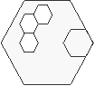

## Document title:  _Enriched multi‑agent middleware for building rule‑based distributed security solutions for IoT environments_

#### The Journal of Supercomputing

https://doi.org/10.1007/s11227-021-03797-2

Accepted: 5 April 2021.

© The Author(s), under exclusive licence to **Springer Science+Business Media**, LLC, part of **Springer Nature  2021**

Francisco José Aguayo‑Canela1  ·  Héctor Alaiz‑Moretón1  ·  María Teresa García‑Ordás1  ·  José Alberto Benítez‑Andrades2  ·  Carmen Benavides2  · Isaías García‑Rodríguez1

:email: José Alberto Benítez-Andrades. <_jbena AT  unileon  DOT es_>

(1)  _**SECOMUCI Research Group**_, School of Industrial Engineering and Informatics. 
(2)  _**SALBIS Research Group**_, Department of Electric, Systems and Automatics Engineering.

 Universidad de León (_Spain_) 

## 1. Example addendum: _RuleBased-Security-Lab_

> This is an example of a distributed application made up of JADE Agents[1]. This example uses three main agent classes:

* **Board-Class**: The Board-class agents are responsible for displaying analysis results, managing the flow of analyzes and, update lastest Malware Rules from SNORT-Community[2]. This type of agents are connected to HSQLite database[3].

* **Analyzer-Class**: This type of agents have an integrated CLIPS[5] or Jess[6] expert-system. They use the SNORT[3] Rules inside of its Working-Memory to detect malware on TCP, IP or UDP datagrams[4].

* **Reader-Class**: It class produces agents with reading .PCAP file format capabilities. They can to transform datagram segments in (facts) format files, which are understandable by CLIPS[5] or Jess[6] inference engines.

 
This laboratory example foccuses on implementation and testing of an intrusion detection system which uses an agent-oriented distributed application deployment. It uses the JADE Framework[1] and the Middleware dpsFramework[7]. This example has been developed for demonstration and academic purposes only.

     

----

   
### 1.1. How to build this _RuleBased-Security-Lab_ application skeleton

1. Download dpsFramework[7] and create new application titled _RuleBased-Security-Lab_:
   * https://github.com/dpsframework/dpsFrameworkBuilder/releases/download/1.8/dpsFrameworkBuilder-full-1.8.jar
   * `  java -jar dpsFrameworkBuilder-full-1.8.jar   --new=RuleBased-Security-Lab`
   * `  cd RuleBased-Security-Lab`

1. Prepare that application skeleton to include the agents of this example:  (Use: `delete` and `rename` on Windows)
   * `  rm -f README.md  `
   * `  mv config      config_old`
   * `  mv nodes       nodes_old` 

1. Create and update the _Malware-Analysis-Lab_ local repository:
   * `  git init . `
   * `  git branch -M master`
   * `  git remote add origin https://github.com/dpsframework/RuleBased-Security-Lab.git`
   * `  git pull origin master`

1. Finally, remove the remote-origin from _RuleBased-Security-Lab_ repository on GitHub:
   * `  git remote remove origin`

### 1.2. How to deploy the new _RuleBased-Security-Lab_ agents on JADE platform 

Please, see [**Appendix A**](#appendix-a), for **Windows OS**.

1. Set **CLASSPATH** variable and launch **JADE** multi-agent platform on **localhost**:
   * `   export CLASSPATH=lib/*:lib/pcap/*:  ` 
   * `  java       launcher platform localhost  & ` 
   
1. Launch a Board-Class Agent, Analyzer-Class Agents and, Reader-Class Agent:
   * `        java launcher board      localhost IDSboard01  &`  
   * `        java launcher stage-node localhost UDPanalyzer01 CLIPS  &`  
   * `        java launcher stage-node localhost TCPanalyzer01 Jess  &`  
   * `        java launcher monitor    localhost PCAPreader01  &` 
   
1. Raise the agents run-level to `5` and start malware scan:
   * Click on button [5] on the menu bar.
   * `  cp    pcap/examples/case01.pcap   var/pending/.`   

## 2. Screenshot gallery

### 2.1. Board-Class Agents: _IDS-board-agent_ 

| Agent GUI interface      | Main activated services, Behaviours and  functions   | Image description  |
|:--------             |:--------------------- |:---------   |
|     | • BoardGridLocal  • nidsDB.service  • doPopulate  | **Image 1**. The log of activities associated with the translation of PCAP files, analyzed files, alerts found and updated rules is displayed on the table.   | 
|     | • Behaviour:    • Function:    | Image **2.**: Title of this image.   | 
|     | • Behaviour:    • Function:    | Image **3.**: Title of this image.   | 
|     | • Behaviour:    • Function:    | Image **4.**: Title of this image.   | 

### 2.2. Analyzer-Class Agents: _UDP-analyzer-agent_ and _TCPanalyzer-agent_

| Agent interface      | Behaviour & Functions   | Image title and description  |
|:--------             |:--------------------- |:---------   |
|     | • Behaviour:    • Function:    | Image **5.**: Title of this image.   | 
|     | • Behaviour:    • Function:    | Image **6.**: Title of this image.   | 
|     | • Behaviour:    • Function:    | Image **7.**: Title of this image.   | 
|     | • Behaviour:    • Function:    | Image **8.**: Title of this image.   | 

### 2.3. Reader-Class Agents: _PCAP-reader-agent_ 

| Agent interface      | Behaviour & Functions   | Image description  |
|:--------             |:--------------------- |:---------   |
|     | • Behaviour:    • Function:    | Image **9.**: Title of this image.   | 
|     | • Behaviour:    • Function:    | Image **10.**: Title of this image.   | 
|     | • Behaviour:    • Function:    | Image **11.**: Title of this image.   | 
|     | • Behaviour:    • Function:    | Image **12.**: Title of this image.   | 

---- 

## References

[1]: **JADE Platform**. <http://jade.tilab.com/>. CSELT, S. & TILab, S. (2017). Jade - java agent development framework. is a framework to develop multi-agent systems in compliance with the fipa specifications. jade 4.5.0 - revision 6825 of 23-05-2017 10:06:04. Open Source, under LGPL restrictions.

[2]: **Snort** - Network Intrusion Detection & Prevention System. (n.d.). Retrieved April 1, 2021, from https://www.snort.org/

[3]: **HyperSQL**: HSQLDB - 100% Java Database. <http://hsqldb.org/>

[4]: **(PDF) Network forensics analysis using Wireshark.** https://www.researchgate.net/publication/281573989_Network_forensics_analysis_using_Wireshark (accessed Mar. 23, 2021).

[5]: **CLIPS**. [**1**] Giarratano, J. C. P. (2014). CLIPS User’s Guide. Version 6.30. CLIPS.  [**2**] Riley, G. (2016). Clips rule based programming language expert system tool clips (6.31) and CLIPSJNI (0.5), clips rule based programming language web site. Available in: <https://sourceforge.net/projects/clipsrules/>.

[6]: **JESS**.  [**1**]Friedman-Hill, E.: JESS, Expert System Software Tool (8.0a1 (alfa)). Sandia National Laboratories. <https://www.jessrules.com/> (2016). [**2**] Friedman-Hill, E. (2003). JESS in Action. Manning Greenwich, CT. [**3**] Cardoso, H. L. (2007). Integrating jade and jess. available in: <https://jade.tilab.com/documentation/examples/jess/>.

[7]: **_dpsFramework_ GitHub Repositories**. <https://github.com/dpsframework>

[8]: **BeanShell**. [**1**] Niemeyer, P.: Lightweight Scripting for Java. <http://www.beanshell.org/> (2014). [**2**] Nick Lombard, BeanShell at GitHub <https://github.com/beanshell/beanshell>. 

[9]: **Leon University** (SPAIN). <http://www.unileon.es>.  **Departamento de Ingeniería Eléctrica y de Sistemas y Automática**. Universidad de León. <https://departamentos.unileon.es/ingenieria-electrica-y-de-sistemas-y-automatica/>

-----

## Appendix A

### Windows OS command-line sentences

####  A.1. How to deploy the new RuleBased-Security-Lab agents on JADE platform

1. Set **CLASSPATH** variable and launch **JADE** multi-agent platform on **localhost**:
   * `   export CLASSPATH=lib/*;lib/pcap/*;  ` 
   * `   start  java launcher platform localhost  ` 

1. Launch a Board-Class Agent, Analyzer-Class Agents and, Reader-Class Agent with:
   * `   start     java launcher board      localhost IDSboard01  `  
   * `   start     java launcher stage-node localhost UDPanalyzer01 CLIPS  `  
   * `   start     java launcher stage-node localhost TCPanalyzer01 Jess  `  
   * `   start     java launcher monitor    localhost PCAPreader01` 

1. Raise the agents run-level to `5` and start malware scan with:
   * Click on button [5] on the menu bar.
   * `  copy    pcap/examples/case01.pcap   var/pending/.`   

1. Launch classic JADE Agents:
   * `   start     java launcher acklin      localhost   `  
   * `   start     java launcher dumm        localhost   `  
   * `   start     java launcher precog      localhost   `  

## Appendix B

### New incorporated functions and behaviours

####  B.1. Distributed application 

####  B.2. Board-Class Agents

| Service name   | About new developed functions & behaviour  |
|:--------             |:--------------------- | 
|     | • Behaviour:    • Function:    | 
|     | • Behaviour:    • Function:    | 
|     | • Behaviour:    • Function:    | 
|     | • Behaviour:    • Function:    | 

