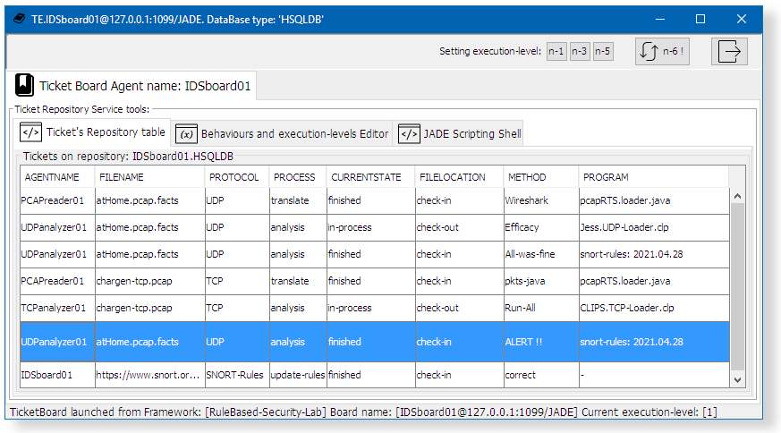
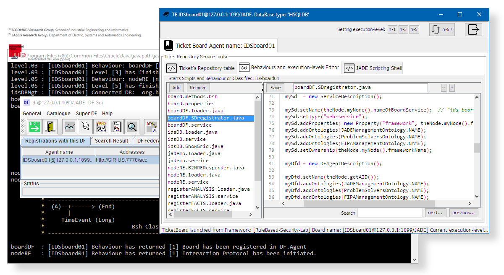

## Document title:  _Enriched multi‑agent middleware for building rule‑based distributed security solutions for IoT environments_

#### The Journal of Supercomputing

https://doi.org/10.1007/s11227-021-03797-2

Accepted: 5 April 2021.

© The Author(s), under exclusive licence to **Springer Science+Business Media**, LLC, part of **Springer Nature  2021**

Francisco José Aguayo‑Canela1  ·  Héctor Alaiz‑Moretón1  ·  María Teresa García‑Ordás1  ·  José Alberto Benítez‑Andrades2  ·  Carmen Benavides2  · Isaías García‑Rodríguez1

:email: José Alberto Benítez-Andrades. <_jbena AT  unileon  DOT es_>

(1)  _**SECOMUCI Research Group**_, School of Industrial Engineering and Informatics. 
(2)  _**SALBIS Research Group**_, Department of Electric, Systems and Automatics Engineering.

![Universidad de Leon[**9**] - Spain](images/marca-logo-color.jpg) Universidad de León (_Spain_) 

## 1. Example addendum: _Rule-Based-Security-Lab_

> This is an example of a distributed application made up of JADE Agents[**1**].  This example uses three main agent classes:

* **Board-Class**: The Board-class agents are responsible for displaying analysis results, managing the flow of analyzes carried out by the agents and, update lastest Malware Rules from SNORT-Community[**2**]. This type of agents are connected to their own HSQLite database[**3**].

* **Analyzer-Class**: This type of agents have an integrated CLIPS[**5**] or Jess[**6**] expert-system. They use the SNORT[**3**] Rules inside of their Working-Memories to detect malware on TCP, IP or UDP protocol datagrams.

* **Reader-Class**: This class produces agents with capabilities to read and interpret files in PCAP[**4**] format. They can to transform datagram segments in (facts) format files, which are understandable by CLIPS[**5**] or Jess[**6**] inference engines.

 
This laboratory example foccuses on implementation and testing of an intrusion detection system which uses an agent-oriented distributed application deployment. It uses the JADE Framework[**1**] and the Middleware dpsFramework[**7**]. This example has been developed for demonstration and academic purposes only.

----

### 1.1. How to build this _Rule-Based-Security-Lab_ application development environment

1. Download dpsFramework[**7**] and create new application titled _RuleBased-Security-Lab_:
   * https://github.com/dpsframework/dpsFrameworkBuilder/releases/download/1.8/dpsFrameworkBuilder-full-1.8.jar
   * `  java -jar dpsFrameworkBuilder-full-1.8.jar   --new=RuleBased-Security-Lab`
   * `  cd RuleBased-Security-Lab`

1. Prepare that application skeleton to include the agents of this example:  (Use: `delete` and `rename` on Windows)
   * `  rm -f README.md  `
   * `  mv config      config_old`
   * `  mv nodes       nodes_old` 

1. Create and update this _RuleBased-Security-Lab_ local repository:
   * `  git init . `
   * `  git branch -M master`
   * `  git remote add origin https://github.com/dpsframework/RuleBased-Security-Lab.git`
   * `  git pull origin master`

1. Remove the **origin** from _RuleBased-Security-Lab_ local repository:
   * `  git remote remove origin`

### 1.2. How to deploy this _Rule-Based-Security-Lab_ agents on JADE platform

1. Set **CLASSPATH** variable and launch **JADE** multi-agent platform on **localhost**:
   * `  export CLASSPATH=lib/*:lib/pcap/*:  ` 
   * `  java       launcher platform localhost  & ` 
   
1. Launch a Board-Class Agent, Analyzer-Class Agents and, Reader-Class Agent:
   * `        java launcher board      localhost IDSboard01  &`  
   * `        java launcher stage-node localhost UDPanalyzer01 CLIPS  &`  
   * `        java launcher stage-node localhost TCPanalyzer01 Jess  &`  
   * `        java launcher monitor    localhost PCAPreader01  &` 
   
1. Raise the agents run-level to `5` and start malware scan:
   * Click on button titled [5] on the menu bar.
   * `  cp    pcap/examples/case01.pcap   var/pending/.`   

Please see [**Appendix A**](#appendix-a), for **Windows operating system** and other additional tricks.

## 2. Screenshot gallery

### 2.1. Board-Class Agents: _IDS-board-agent_ 

| Agent GUI Interface   | Main activated Services, Classes, Functions and Behaviour | Image description  |
|:--------             |:--------------------- |:---------   |
|     | • idsDB._service_  • ShowGrid\{.\}  • doPopulate( )  | **Image 1**. Board-Class agents can display the log of activities associated with the translation of PCAP files, analyzed files records, alerts found and updated Snort rules. All that information is shown in the grid, using first tab: "Ticket's repository table".   | 
|     | • boardDF._service_  • SDregistrator\{.\}  | **Image 2**. Each IDS-Board-agent instance is registered in the Directory Facilitator (**DF**) of JADE Platform. The Board-Class agents are critical in a possible real-world implementation. For this reason, these agents self-register in the **DF** agent catalogue and could be recovered thanks to the _fault tolerance_ provided by JADE when the DF Service uses persistence [**10a**].  | 
|     | • registerFACTS._service_  • registerINFORM._service_  • registerANALYSIS._service_  • idsDBGridUpdate( )   • **RE**responseFACTS  • **RE**responseINFORM  • **RE**responseANALYSIS  | **Image 3**. An IDS-board agent instance handles the requests received from Reader-Class agents and from Analyzer-Class agents through three Listen Services. Those services require complex communicative acts and they use Interaction Protocol through implemented _Rational-Effect_ (**RE**) JADE behaviours.    _NOTE:_ These Behaviors always go in pairs. One for initializing the protocol (**RE**init..) and another as a response to meet that demand. | 
|     | • registerRULES._service_  • RulesDownloader\{.\}  • snortToCLIPS\_KBase( )   • **RE**responseKBASE  |  **Image 4**. Every 2 days, an IDS-board agent instance downloads the latest rules on SNORT Community Website from the Internet and converts them to CLIPS / Jess rules through a simple conversion function `snortToCLIPS_KBase( )`. When the agent receives a request message from Analyzer-Class agents, it compares date from request against date of updated SNORT Rules. And the IDS-board agent submit a new CLIPS KBASE format file if applicable.  | 

### 2.2. Analyzer-Class Agents: _UDP-analyzer-agent_ and _TCP-analyzer-agent_

| Agent GUI Interface   | Main activated Services, Classes, Functions and Behaviour  | Image description  |
|:--------             |:--------------------- |:---------   |
|     | • analysis._service_  • load\_WorkingMemory( )   • **RE**initANALYSIS  • **RE**initINFORM  | **Image 5**. Every 15 minutes Analyzer-Class agents request to an IDS-board-agent for new pending analysis files. If agents receive a file as response, the `load_WorkingMemory( )` function load it in their Working-Memory and the analysis begins.  The **RE**initINFORM behaviour-class sends results to IDS-board agent when analysis has finished.  |
|     | • updateKBASE._service_  • reload\_KBase( )   • **RE**initKBASE  |  **Image 6**. Every 24 hours Analyzer-Class agents request to an IDS-board agent the lastest updated SNORT rules converted to CLIPS/jess rules format. If agents receive a file as response, the `reload_KBase( )` function updates their Knowledge-Base and their engines are restarted. |

### 2.3. Reader-Class Agents: _PCAP-reader-agent_ 

| Agent GUI Interface   | Main activated Services, Classes, Functions and Behaviour  | Image description  |
|:--------             |:--------------------- |:---------   |
|     | • readerPCAP._service_  • WatchdogDirectory\{.\}  • watingForPCAP( )  • transformToFACTS( )  |  **Image 7**. Every 5 minutes Reader-Class agents are looking for new .PCAP files on `./var/pending/` diectory. If they find  a .PCAP file they move it to their own directories, open it and transform to expert system _Facts_ plain text file with `transformToFACTS( )` function. |
|     | • dispatcherFACTS._service_   • **RE**initFACTS   |  **Image 8**. When Reader-Class agents receive a message from their owns reader/transform services `readerPCAP._service_`, they compress the _Facts_ plain text file and send it as Inform-Message to an IDS-board-agent. |

-----

## Appendix A

### Windows OS command-line sentences

####  A.1. How to deploy the new RuleBased-Security-Lab agents on JADE platform

1. Set **CLASSPATH** variable and launch **JADE** multi-agent platform on **localhost**:
   * `   export CLASSPATH=lib/*;lib/pcap/*;  ` 
   * `   start  java launcher platform localhost  ` 

1. Launch a Board-Class Agent, Analyzer-Class Agents and, Reader-Class Agent with:
   * `   start     java launcher board      localhost IDSboard01  `  
   * `   start     java launcher stage-node localhost UDPanalyzer01 CLIPS  `  
   * `   start     java launcher stage-node localhost TCPanalyzer01 Jess  `  
   * `   start     java launcher monitor    localhost PCAPreader01` 

1. Raise the agents run-level to `5` and start malware scan with:
   * Click on button [5] on the menu bar.
   * `  copy    pcap/examples/case01.pcap   var/pending/.`   

1. Launch classic JADE Agents:
   * `   start     java launcher acklin      localhost   `  
   * `   start     java launcher dumm        localhost   `  
   * `   start     java launcher sniff      localhost   `  
   

---- 

## References

[1]: **JADE Platform**. <http://jade.tilab.com/>. CSELT, S. & TILab, S. (2017). Jade - java agent development framework. is a framework to develop multi-agent systems in compliance with the fipa specifications. jade 4.5.0 - revision 6825 of 23-05-2017 10:06:04. Open Source, under LGPL restrictions.

[2]: **Snort** - Network Intrusion Detection & Prevention System. (n.d.). Retrieved April 1, 2021, from https://www.snort.org/

[3]: **HyperSQL**: HSQLDB - 100% Java Database. <http://hsqldb.org/>

[4]: **(PDF) Network forensics analysis using Wireshark.** https://www.researchgate.net/publication/281573989_Network_forensics_analysis_using_Wireshark (accessed Mar. 23, 2021).

[5]: **CLIPS**. [**1**] Giarratano, J. C. P. (2014). CLIPS User’s Guide. Version 6.30. CLIPS.  [**2**] Riley, G. (2016). Clips rule based programming language expert system tool clips (6.31) and CLIPSJNI (0.5), clips rule based programming language web site. Available in: <https://sourceforge.net/projects/clipsrules/>.

[6]: **JESS**.  [**1**]Friedman-Hill, E.: JESS, Expert System Software Tool (8.0a1 (alfa)). Sandia National Laboratories. <https://www.jessrules.com/> (2016). [**2**] Friedman-Hill, E. (2003). JESS in Action. Manning Greenwich, CT. [**3**] Cardoso, H. L. (2007). Integrating jade and jess. available in: <https://jade.tilab.com/documentation/examples/jess/>.

[7]: **_dpsFramework_ GitHub Repositories**. <https://github.com/dpsframework>

[8]: **BeanShell**. [**1**] Niemeyer, P.: Lightweight Scripting for Java. <http://www.beanshell.org/> (2014). [**2**] Nick Lombard, BeanShell at GitHub <https://github.com/beanshell/beanshell>. 

[9]: **Leon University** (SPAIN). <http://www.unileon.es>.  **Departamento de Ingeniería Eléctrica y de Sistemas y Automática**. Universidad de León. <https://departamentos.unileon.es/ingenieria-electrica-y-de-sistemas-y-automatica/>

[10]: **Yellow pages JADE Service**. [**a**] Bellifemine, F.L., Caire, G., Greenwood, D.: Developing Multi-Agent Systems with JADE. Wiley Series in Agent Technology. (2007). [**b**] Cancedda, P. & Caire, G. (2010). JADE Tutorial Creating Ontologies by means of the Bean-Ontology Class, volume 15-April-2010 - JADE 4.0. Telecom Italia S.p.A. [**c**] Yellow Pages examples: <https://jade.tilab.com/documentation/examples/yellow-pages/>

