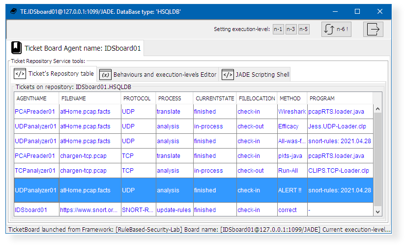

## Document title:  _Enriched multi‑agent middleware for building rule‑based distributed security solutions for IoT environments_

#### The Journal of Supercomputing

https://doi.org/10.1007/s11227-021-03797-2

Accepted: 5 April 2021.

© The Author(s), under exclusive licence to **Springer Science+Business Media**, LLC, part of **Springer Nature  2021**

Francisco José Aguayo‑Canela1  ·  Héctor Alaiz‑Moretón1  ·  María Teresa García‑Ordás1  ·  José Alberto Benítez‑Andrades2  ·  Carmen Benavides2  · Isaías García‑Rodríguez1

:email: José Alberto Benítez-Andrades. <_jbena AT  unileon  DOT es_>

(1)  _**SECOMUCI Research Group**_, School of Industrial Engineering and Informatics. 
(2)  _**SALBIS Research Group**_, Department of Electric, Systems and Automatics Engineering.

![Universidad de Leon[**9**] - Spain](images/marca-logo-color.jpg) Universidad de León (_Spain_) 

## 1. Example addendum: _Rule-Based-Security-Lab_

> This is an example of a distributed application made up of JADE Agents[**1**]. This example uses three main agent classes:

* **Board-Class**: The Board-class agents are responsible for displaying analysis results, managing the flow of analyzes and, update lastest Malware Rules from SNORT-Community[**2**]. This type of agents are connected to HSQLite database[**3**].

* **Analyzer-Class**: This type of agents have an integrated CLIPS[**5**] or Jess[**6**] expert-system. They use the SNORT[**3**] Rules inside of its Working-Memory to detect malware on TCP, IP or UDP datagrams[**4**].

* **Reader-Class**: It class produces agents with reading .PCAP file format capabilities. They can to transform datagram segments in (facts) format files, which are understandable by CLIPS[**5**] or Jess[**6**] inference engines.

 
This laboratory example foccuses on implementation and testing of an intrusion detection system which uses an agent-oriented distributed application deployment. It uses the JADE Framework[**1**] and the Middleware dpsFramework[**7**]. This example has been developed for demonstration and academic purposes only.

----

### 1.1. How to build this _Rule-Based-Security-Lab_ application development environment

1. Download dpsFramework[**7**] and create new application titled _RuleBased-Security-Lab_:
   * https://github.com/dpsframework/dpsFrameworkBuilder/releases/download/1.8/dpsFrameworkBuilder-full-1.8.jar
   * `  java -jar dpsFrameworkBuilder-full-1.8.jar   --new=RuleBased-Security-Lab`
   * `  cd RuleBased-Security-Lab`

1. Prepare that application skeleton to include the agents of this example:  (Use: `delete` and `rename` on Windows)
   * `  rm -f README.md  `
   * `  mv config      config_old`
   * `  mv nodes       nodes_old` 

1. Create and update this _RuleBased-Security-Lab_ local repository:
   * `  git init . `
   * `  git branch -M master`
   * `  git remote add origin https://github.com/dpsframework/RuleBased-Security-Lab.git`
   * `  git pull origin master`

1. Remove the **origin** from _RuleBased-Security-Lab_ local repository:
   * `  git remote remove origin`

### 1.2. How to deploy this _Rule-Based-Security-Lab_ agents on JADE platform

1. Set **CLASSPATH** variable and launch **JADE** multi-agent platform on **localhost**:
   * `  export CLASSPATH=lib/*:lib/pcap/*:  ` 
   * `  java       launcher platform localhost  & ` 
   
1. Launch a Board-Class Agent, Analyzer-Class Agents and, Reader-Class Agent:
   * `        java launcher board      localhost IDSboard01  &`  
   * `        java launcher stage-node localhost UDPanalyzer01 CLIPS  &`  
   * `        java launcher stage-node localhost TCPanalyzer01 Jess  &`  
   * `        java launcher monitor    localhost PCAPreader01  &` 
   
1. Raise the agents run-level to `5` and start malware scan:
   * Click on button titled [5] on the menu bar.
   * `  cp    pcap/examples/case01.pcap   var/pending/.`   

Please see [**Appendix A**](#appendix-a), for **Windows operating system** and other additional tricks.

## 2. Screenshot gallery

### 2.1. Board-Class Agents: _IDS-board-agent_ 

| Agent GUI Interface   | Main activated Services, Behaviour and  Functions   | Image description  |
|:--------             |:--------------------- |:---------   |
|     | • nidsDB.service  • nidsDB.ShowGrid.class  • doPopulate()  | **Image 1**. Board-Class agents can show the log of activities associated with the translation of PCAP files, analyzed files records, alerts found and updated Snort rules. All that information is displayed on the grid, on first tab: "Ticket's repository table".   | 
|     | • boardDF.service  • boardDF.SDregistrator.class  • DFAgentDescription()  | **Image 2**. Each IDS-Board-agent is registered using; the boardDF service. Board-Class agents are critical in a possible real-world deployment. For this reason, these agents self-register in the **DF** agent catalogue and can be recovered thanks to the _fault tolerance_ provided by JADE when the DF agent uses persistence [**11**].  | 
|     | • lstnPCAP.service  • lstnANLZ.service  • REresponderPCAP.class  • REresponderANLZ.class  • nidsDBupdate()  |  **Image 3**. An IDS board agent handles the requests of Reader-Class and Analyzer-Class agents  through the Listener Services and using communication _Rational-Effect_ behaviors .   | 
|     | • upSNORT.service  • REresponderKBASE  • BoardUpdateRules.class  • snort2clipsRules()  |  **Image 4**. Every 2 days an IDS-board agent downloads latest SNORT-Community Rules from Internet and converts it to CLIPS/Jess Rules through a simple conversion function. It informs of its availability to Analyzer-Class agents.   | 

### 2.2. Analyzer-Class Agents: _UDP-analyzer-agent_ and _TCP-analyzer-agent_

| Agent GUI Interface   | Main activated Services, Behaviour and  Functions   | Image description  |
|:--------             |:--------------------- |:---------   |
|     | • requestANLZ.service  • securityLAB.service  • RErequestANLZ.class  • REinformRESULTS.class  • datagramFactsLoader()  |  **Image 5**. Every 15 minutes Analyzer-Class agents request to IDS-board-agent some pending analysis. If agents receive a file as response, the _datagramFactsLoader()_ function load it in their Working-Memory. All that FACTS are compared with SNORT Rules present in their Knowledge-Base. The REinformRESULTS behaviour-class sends results to IDS-board agent when analysis has finished.   |
|     | • latestKBASE.service  • RErequestKBASE.class  • knowledgeBaseLoader()  |  **Image 6**. Every 24 hours Analyzer-Class agents request to IDS-board agent the lastest updated SNORT rules. If agents receive a file as response, the `knowledgeBaseLoader()` function updates their Knowledge-Base and their engines are restarted. |

### 2.3. Reader-Class Agents: _PCAP-reader-agent_ 

| Agent GUI Interface   | Main activated Services, Behaviour and  Functions   | Image description  |
|:--------             |:--------------------- |:---------   |
|     | • Behaviour:    • Function:    | Image **9.**: Title of this image.   | 
|     | • Behaviour:    • Function:    | Image **10.**: Title of this image.   | 
|     | • Behaviour:    • Function:    | Image **11.**: Title of this image.   | 
|     | • Behaviour:    • Function:    | Image **12.**: Title of this image.   | 

---- 

## References

[1]: **JADE Platform**. <http://jade.tilab.com/>. CSELT, S. & TILab, S. (2017). Jade - java agent development framework. is a framework to develop multi-agent systems in compliance with the fipa specifications. jade 4.5.0 - revision 6825 of 23-05-2017 10:06:04. Open Source, under LGPL restrictions.

[2]: **Snort** - Network Intrusion Detection & Prevention System. (n.d.). Retrieved April 1, 2021, from https://www.snort.org/

[3]: **HyperSQL**: HSQLDB - 100% Java Database. <http://hsqldb.org/>

[4]: **(PDF) Network forensics analysis using Wireshark.** https://www.researchgate.net/publication/281573989_Network_forensics_analysis_using_Wireshark (accessed Mar. 23, 2021).

[5]: **CLIPS**. [**1**] Giarratano, J. C. P. (2014). CLIPS User’s Guide. Version 6.30. CLIPS.  [**2**] Riley, G. (2016). Clips rule based programming language expert system tool clips (6.31) and CLIPSJNI (0.5), clips rule based programming language web site. Available in: <https://sourceforge.net/projects/clipsrules/>.

[6]: **JESS**.  [**1**]Friedman-Hill, E.: JESS, Expert System Software Tool (8.0a1 (alfa)). Sandia National Laboratories. <https://www.jessrules.com/> (2016). [**2**] Friedman-Hill, E. (2003). JESS in Action. Manning Greenwich, CT. [**3**] Cardoso, H. L. (2007). Integrating jade and jess. available in: <https://jade.tilab.com/documentation/examples/jess/>.

[7]: **_dpsFramework_ GitHub Repositories**. <https://github.com/dpsframework>

[8]: **BeanShell**. [**1**] Niemeyer, P.: Lightweight Scripting for Java. <http://www.beanshell.org/> (2014). [**2**] Nick Lombard, BeanShell at GitHub <https://github.com/beanshell/beanshell>. 

[9]: **Leon University** (SPAIN). <http://www.unileon.es>.  **Departamento de Ingeniería Eléctrica y de Sistemas y Automática**. Universidad de León. <https://departamentos.unileon.es/ingenieria-electrica-y-de-sistemas-y-automatica/>

[10]: **Yellow pages JADE Service**. [**a**] Bellifemine, F.L., Caire, G., Greenwood, D.: Developing Multi-Agent Systems with JADE. Wiley Series in Agent Technology. (2007). [**b**] Cancedda, P. & Caire, G. (2010). JADE Tutorial Creating Ontologies by means of the Bean-Ontology Class, volume 15-April-2010 - JADE 4.0. Telecom Italia S.p.A. [**c**] Yellow Pages examples: <https://jade.tilab.com/documentation/examples/yellow-pages/>

-----

## Appendix A

### Windows OS command-line sentences

####  A.1. How to deploy the new RuleBased-Security-Lab agents on JADE platform

1. Set **CLASSPATH** variable and launch **JADE** multi-agent platform on **localhost**:
   * `   export CLASSPATH=lib/*;lib/pcap/*;  ` 
   * `   start  java launcher platform localhost  ` 

1. Launch a Board-Class Agent, Analyzer-Class Agents and, Reader-Class Agent with:
   * `   start     java launcher board      localhost IDSboard01  `  
   * `   start     java launcher stage-node localhost UDPanalyzer01 CLIPS  `  
   * `   start     java launcher stage-node localhost TCPanalyzer01 Jess  `  
   * `   start     java launcher monitor    localhost PCAPreader01` 

1. Raise the agents run-level to `5` and start malware scan with:
   * Click on button [5] on the menu bar.
   * `  copy    pcap/examples/case01.pcap   var/pending/.`   

1. Launch classic JADE Agents:
   * `   start     java launcher acklin      localhost   `  
   * `   start     java launcher dumm        localhost   `  
   * `   start     java launcher sniff      localhost   `  
   

## Appendix B

### New incorporated functions and behaviours

####  B.1. Distributed application 

####  B.2. Board-Class Agents

| Service name   | About new developed functions & behaviour  |
|:--------             |:--------------------- | 
|     | • Behaviour:    • Function:    | 
|     | • Behaviour:    • Function:    | 
|     | • Behaviour:    • Function:    | 
|     | • Behaviour:    • Function:    | 

